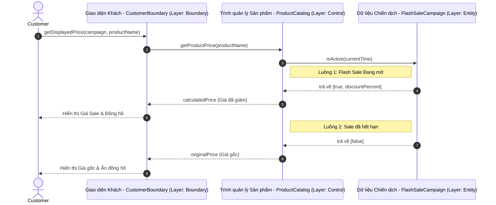
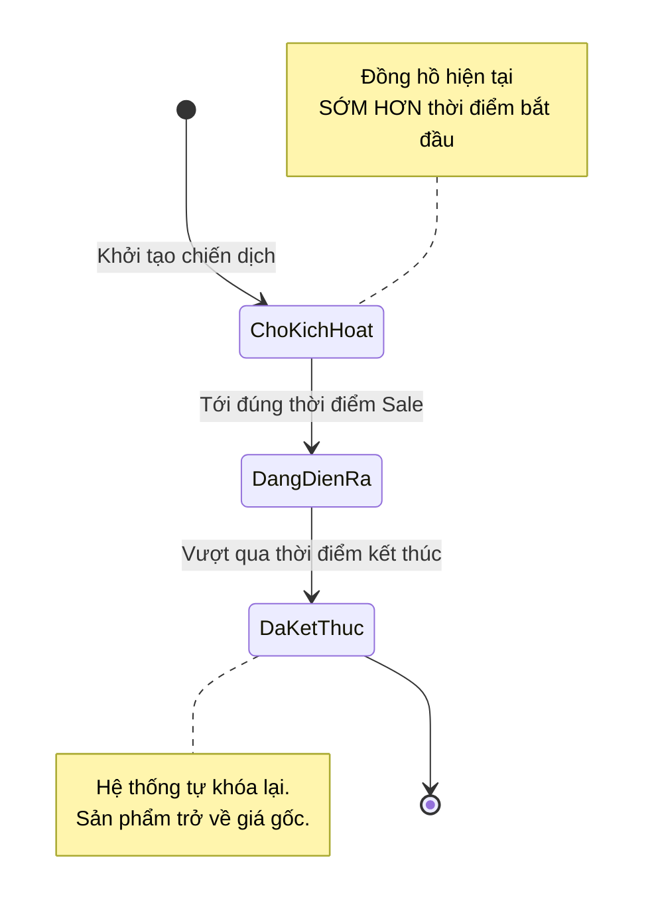
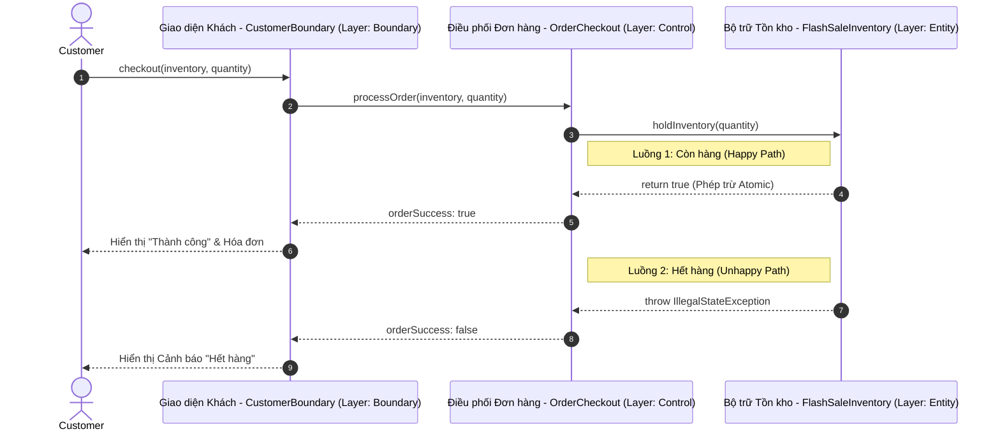
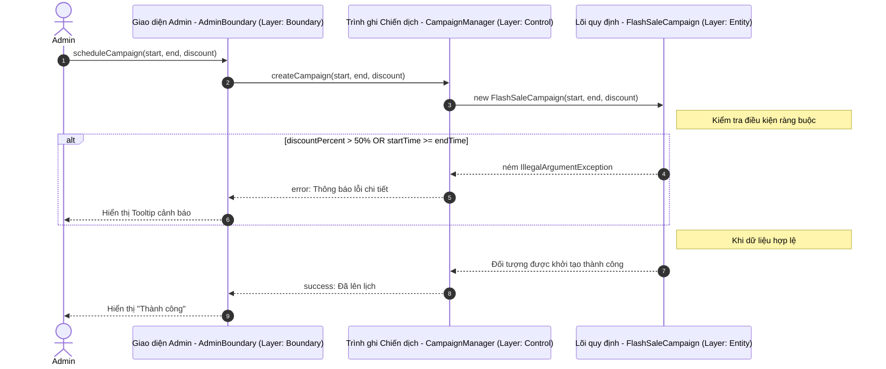
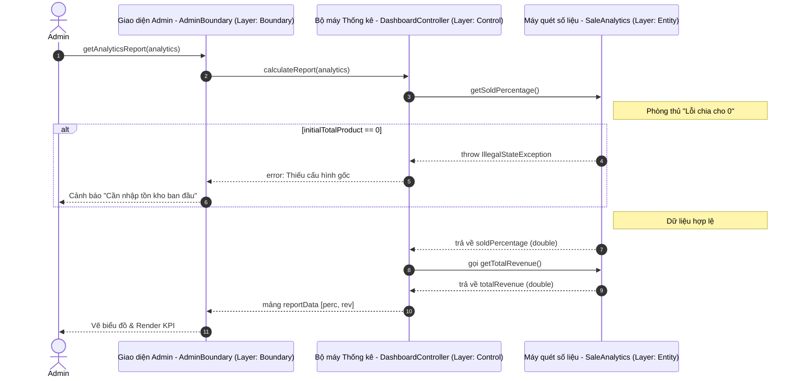
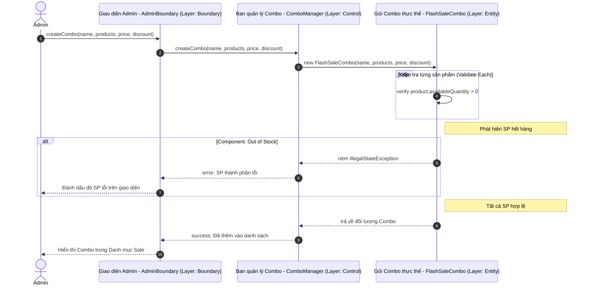
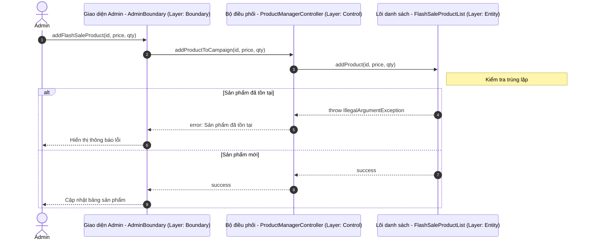
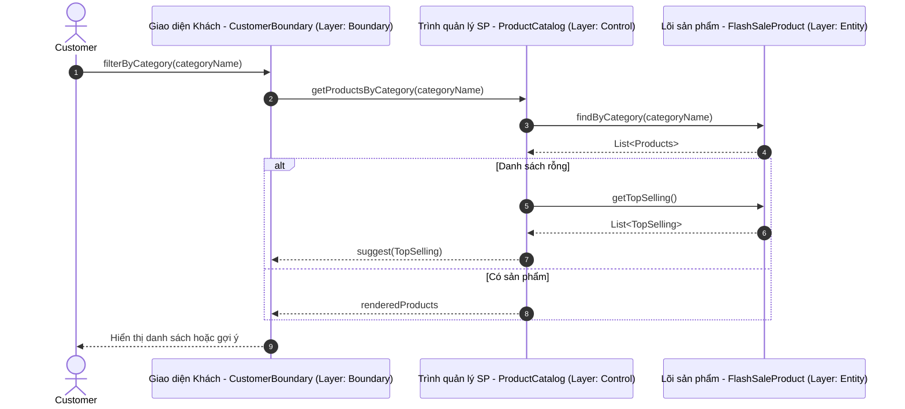
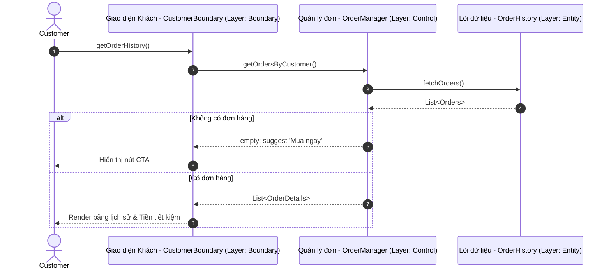

## 🟢 US1: Hiển thị trạng thái Flash Sale trên sản phẩm

### 1. Kiến trúc BCE (Boundary - Control - Entity)
> **Giải thích:** Khách hàng (Boundary) không trực tiếp đòi dữ liệu từ hệ thống tính toán (Entity), mà bắt buộc phải thông qua Bộ lọc (Control) làm nhiệm vụ bảo vệ logic.
```text
  [ BOUNDARY / GIAO DIỆN ]                ( CONTROL / XỬ LÝ )                 { ENTITY / LÕI NGHIỆP VỤ }
  
  ╔════════════════════╗               ┌────────────────────┐               ⟪──────────────────────⟫
  ║ MÀN HÌNH MUA HÀNG  ║ = Lấy SP ===> │ TRÌNH QUẢN LÝ DANH │ == Truy vấn =>│ DỮ LIỆU CHIẾN DỊCH & │
  ║ (CustomerBoundary) ║               │ MỤC (ProductCatalog)│               │ MỨC GIẢM (Campaign)  │
  ╚════════════════════╝ <== Trả về == └────────────────────┘ <== Kết quả ==⟪──────────────────────⟫
   Là nơi khách xem, nhấn                Là nhân viên chạy bàn                Là nhà bếp nấu công thức
```

### 2. Sơ đồ Tuần Tự (Sequence Diagram)
> **Kỹ thuật:** Luồng xử lý lấy thông tin giá từ Layer Boundary qua Control tới Entity.



**Chi tiết luồng dữ liệu (Data Flow):**
1. **Dữ liệu đầu vào (Input Artifacts):** Nhận `Campaign` (Đối tượng chiến dịch), thời gian hệ thống (`currentTime`) và tên sản phẩm.
2. **Tiến trình xử lý (Technical Processing):**
    * `CustomerBoundary` tiếp nhận yêu cầu từ người dùng, thực hiện ủy thác (delegation) việc xử lý dữ liệu cho `ProductCatalog`.
    * `ProductCatalog` (Control) đóng vai trò trung gian, phối hợp kiểm tra tính hiệu lực qua thực thể `FlashSaleCampaign`.
    * `FlashSaleCampaign` (Entity) thực hiện so khớp thời gian (Temporal matching) để xác định xem `currentTime` có nằm trong cửa sổ Sale hay không.
3. **Đặc tính kỹ thuật (Technical Specs):**
    * **Decoupling**: Logic hiển thị tách biệt hoàn toàn khỏi logic nghiệp vụ, đảm bảo dễ dàng thay đổi giao diện mà không ảnh hưởng tới cách tính thời gian.
    * **Temporal Validation**: Hệ thống sử dụng thời gian của máy chủ (Server-side) để ngăn chặn việc gian lận thời gian từ phía Client.
4. **Kết quả trả về (Output):** Trả về giá đã được tính toán (Calculated Price) kèm theo cờ trạng thái (`isActive`) để lớp Boundary quyết định việc render đồng hồ đếm ngược.

### 3. Sơ đồ Trạng Thái (State Diagram)
> **Giải thích:** Vòng đời của một chiến dịch đi từ lúc ngủ đông đến lúc tự đào thải.


### 4. Thiết kế Cấu trúc file & Màn hình hiển thị
> Nơi các kỹ sư lưu trữ File và Giao diện phác thảo tương ứng.

```text
📁 CẤU TRÚC FOLDER THEO BCE:
 src/
  ╰─ main/java/com/cosmetics/flashsale/
      ├─ boundary/     ->  CustomerBoundary.ui (File thiết kế giao diện màu sắc)
      ├─ control/      ->  ProductCatalog.java (File điều chế kết nối)
      ╰─ entity/       ->  FlashSaleCampaign.java (File công thức tính toán thời gian)


🖥️ MÀN HÌNH WIREFRAME:
 ╭──────────────────────────────────────────────────────────╮
 │  < Quay lại               Chi tiết Son MAC Ruby Woo      │
 ├──────────────────────────────────────────────────────────┤
 │                                                          │
 │   ╭──────────────╮    [⚡ FLASH SALE ĐANG MỞ BÁN]       │
 │   │              │                                       │
 │   │      [📸]    │    Giá niêm yết: ~~1.500.000 VNĐ~~    │
 │   │   ẢNH CỦA    │    Giá k.mãi:    1.000.000 VNĐ        │
 │   │   SẢN PHẨM   │                                       │
 │   │              │   ╰ Đã tiết kiệm: 500.000 VNĐ ╯       │
 │   ╰──────────────╯                                       │
 │                                                          │
 │   ⏱ Đồng hồ hết hạn: 02:45:10      [ 🛒 THÊM VÀO GIỎ ]  │
 ╰──────────────────────────────────────────────────────────╯
```

---

## 🟢 US2: Xử lý tồn kho và thanh toán

### 1. Kiến trúc BCE
> **Giải thích:** Khi bấm giỏ hàng, thông tin truyền qua Bộ Check-out để đi xin cấp phép trừ kho ảo tại Cột Inventory (Nằm sâu và an toàn nhất).
```text
  [ BOUNDARY / GIAO DIỆN ]                ( CONTROL / XỬ LÝ )                 { ENTITY / LÕI NGHIỆP VỤ }
  
  ╔════════════════════╗               ┌────────────────────┐               ⟪──────────────────────⟫
  ║ GIAO DIỆN XÁC NHẬN ║ = Bấm mua ==> │ ĐIỀU PHỐI ĐƠN HÀNG │ === Lệnh ===> │ BỘ BẢO MẬT TỒN KHO   │
  ║ (CheckoutBoundary) ║               │   (OrderCheckout)  │               │ (FlashSaleInventory) │
  ╚════════════════════╝ <== T/C, Lỗi= └────────────────────┘ <== Trừ kho ==⟪──────────────────────⟫
```

### 2. Sơ đồ Tuần Tự (Sequence Diagram)
> **Kỹ thuật:** Luồng xử lý đặt hàng và trừ tồn kho an toàn (Thread-safe logic).



**Chi tiết luồng dữ liệu (Data Flow):**
1. **Dữ liệu đầu vào (Input Artifacts):** `requestedQuantity` (Số lượng sản phẩm khách muốn mua) và Thực thể kho `FlashSaleInventory`.
2. **Tiến trình xử lý (Technical Processing):**
    * `OrderCheckout` (Control) triệu hồi phương thức `holdInventory` tại lớp Entity.
    * Thực thể kho kiểm tra xác thực số dư khả dụng (`availableQuantity >= quantity`). 
    * Nếu thỏa mãn, thực hiện biến đổi trạng thái (State mutation) bằng cách trừ trực tiếp vào bộ nhớ.
3. **Đặc tính kỹ thuật (Technical Specs):**
    * **Thread-safety**: Sử dụng cơ chế khóa đồng bộ (`synchronized`) đảm bảo tính nguyên tử (Atomicity), ngăn chặn tình trạng thất thoát kho hoặc bán quá mức (Overselling) khi có hàng nghìn người cùng mua một lúc.
    * **Fail-fast Logic**: Nếu kho không đủ, hệ thống ném `IllegalStateException` ngay lập tức để ngắt tiến trình (Interrupt process), đảm bảo không tạo đơn hàng khống.
4. **Đầu ra (Output):** Trả về trạng thái giao dịch thành công (Boolean) và cập nhật số dư kho thực tế trên RAM.

### 3. Thiết kế Cấu trúc file & Màn hình hiển thị
```text
📁 CẤU TRÚC FOLDER:
 src/
  ╰─ main/java/.../
      ├─ boundary/     ->  CheckoutBoundary.html (Nút bấm thanh toán)
      ├─ control/      ->  OrderCheckout.java (Điều khiển giao tiếp giữ chỗ lệnh)
      ╰─ entity/       ->  FlashSaleInventory.java (Giữ khư khư thông tin Số Lượng)

🖥️ MÀN HÌNH WIREFRAME:
 ╭──────────────────────────────────────────────────────────╮
 │  Thanh toán giỏ hàng                                     │
 ├──────────────────────────────────────────────────────────┤
 │                                                          │
 │  Son MAC Ruby Woo                                        │
 │  SL: [ - ]  2  [ + ]   ................... 2.000.000 VNĐ │
 │                                                          │
 │  Tổng cộng (đã giảm):                    2.000.000 VNĐ   │
 │                                                          │
 │   ╔══════════════════════════════════════════════════╗   │
 │   ║ ⚠️ LỖI BÁO TỪ MÁY CHỦ:                           ║   │ <--- (Hiển thị mượt mà)
 │   ║    Rất tiếc! Số suất Flash Sale đã hết.          ║   │
 │   ╚══════════════════════════════════════════════════╝   │
 │                                                          │
 │                     [ XÁC NHẬN ĐẶT HÀNG ]                │
 ╰──────────────────────────────────────────────────────────╯
```

---

## 🟢 US3: Thiết lập chiến dịch (Dành cho Quản trị viên)

### 1. Kiến trúc BCE
> **Giải thích:** Quản lý làm việc với biểu mẫu, Controller truyền tới lõi, nếu % lớn hơn kịch trần, Entity sẽ "cạch mặt" từ chối lưu.
```text
  [ BOUNDARY / GIAO DIỆN ]                ( CONTROL / XỬ LÝ )                 { ENTITY / LÕI NGHIỆP VỤ }
  
  ╔════════════════════╗               ┌────────────────────┐               ⟪──────────────────────⟫
  ║ GIAO DIỆN ADMIN    ║ = Nhấn Lưu => │ BAN QUẢN LÝ TỰ ĐỘNG│ === Lệnh ===> │ BỘ NHIỆM VỤ SINH MỚI │
  ║   (AdminForm)      ║               │  (CampaignManager) │               │ (FlashSaleCampaign)  │
  ╚════════════════════╝ <== T/C, Lỗi= └────────────────────┘ <== Báo lỗi ==⟪──────────────────────⟫
```

### 2. Sơ đồ Tuần Tự (Sequence Diagram)
> **Kỹ thuật:** Luồng nghiệp vụ cấu hình chiến dịch mới kèm theo các ràng buộc bảo vệ biên lợi nhuận.



**Chi tiết luồng dữ liệu (Data Flow):**
1. **Dữ liệu đầu vào (Input Artifacts):** `startTime`, `endTime` (Dạng LocalDateTime) và mức giảm giá `discountPercent`.
2. **Tiến trình xử lý (Technical Processing):**
    * `CampaignManager` (Control) đóng vai trò điều phối, khởi tạo thực thể `FlashSaleCampaign` mới.
    * Toàn bộ quy tắc kiểm soát biên lợi nhuận được thực thi ngay tại tầng khởi tạo (Constructor validation).
3. **Đặc tính kỹ thuật (Technical Specs):**
    * **Constructor Guard**: Ngăn chặn việc tạo ra các thực thể "không hợp lệ" ngay từ giai đoạn cấp phát vùng nhớ (ví dụ: Sale > 50% hoặc thời gian bắt đầu sau thời gian kết thúc).
    * **Business Rule Enforcement**: Chuyển đổi quy định hành chính sang quy định cứng trong mã nguồn (Hard-coded constraints), giảm thiểu sai sót do con người.
4. **Kết quả (Result):** Một thực thể chiến dịch hợp lệ được nạp vào danh sách quản lý, sẵn sàng hoạt động ngay khi tới giờ.

### 3. Thiết kế Cấu trúc file & Màn hình hiển thị
```text
📁 CẤU TRÚC FOLDER:
 src/
  ╰─ main/java/.../
      ├─ boundary/     ->  AdminFormBoundary.html (Bảng nhập giá trị)
      ├─ control/      ->  CampaignManager.java (Đóng vai thư ký lưu hồ sơ)
      ╰─ entity/       ->  FlashSaleCampaign.java (Các quy định cứng)

🖥️ MÀN HÌNH WIREFRAME:
 ╭──────────────────────────────────────────────────────────╮
 │  [ADMIN] Tạo mới chiến dịch Flash Sale                   │
 ├──────────────────────────────────────────────────────────┤
 │                                                          │
 │  📅 Ngày & Giờ bắt đầu:  [ 2026-04-20 08:00 ▾]         │
 │  📅 Ngày & Giờ kết thúc: [ 2026-04-20 12:00 ▾]         │
 │                                                          │
 │  🔥 Điền mức sale (%):                                   │
 │   ╭──────────────────────────────────╮                   │
 │   │ 60                               │ ❌ Không hộp lệ  │
 │   ╰──────────────────────────────────╯                   │
 │  [ LƯU CHIẾN DỊCH KHUYẾN MÃI ]                           │
 │                                                          │
 │  > _Mức giảm cho phép vượt rào kịch trần là 50%_         │
 ╰──────────────────────────────────────────────────────────╯
```

---

## 🟢 US4: Báo cáo hiệu quả thời gian thực

### 1. Kiến trúc BCE
> **Giải thích:** Admin ngồi xem Dashboard, hệ thống phải liên tục móc qua Analytics nhẩm tỷ lệ. Đề phòng máy nhẩm lỗi nếu Cấu hình chưa được nhập từ trước.
```text
  [ BOUNDARY / GIAO DIỆN ]                ( CONTROL / XỬ LÝ )                 { ENTITY / LÕI NGHIỆP VỤ }
  
  ╔════════════════════╗               ┌────────────────────┐               ⟪──────────────────────⟫
  ║ TẤM NỀN CHARTIST   ║ = Yêu cầu ==> │ CỘNG TÁC VIÊN ĐỌC  │ === Chọc ===> │ MÁY QUÉT KPI NHÀ KHO │
  ║(DashboardBoundary) ║               │ (DashboardControl)  │               │   (SaleAnalytics)    │
  ╚════════════════════╝ <== Đồ Thị == └────────────────────┘ <== Kết quả ==⟪──────────────────────⟫
```

### 2. Sơ đồ Tuần Tự (Sequence Diagram)
> **Kỹ thuật:** Luồng truy vấn báo cáo thời gian thực từ Entity Sales.



**Chi tiết luồng dữ liệu (Data Flow):**
1. **Dữ liệu đầu vào (Input Artifacts):** Thực thể `SaleAnalytics` chứa tổng doanh thu lũy kế và số lượng hàng đã tiêu thụ.
2. **Tiến trình xử lý (Technical Processing):**
    * `DashboardController` (Control) truy xuất các trạng thái số liệu hiện hành từ Entity.
    * Thực hiện các phép toán tổng hợp (Aggregation) và chuyển đổi dữ liệu sang định dạng báo cáo.
3. **Đặc tính kỹ thuật (Technical Specs):**
    * **Division-by-Zero Protection**: Kiểm soát lỗi số học tại tầng Entity; nếu chưa cấu hình số lượng tổng ban đầu, hệ thống sẽ trả về 0% và cảnh báo thay vì gây sập ứng dụng.
    * **Real-time Observability**: Dữ liệu được tính toán tức thì từ dữ liệu thực trong RAM, đảm bảo Dashboard luôn phản ánh chính xác tình hình kinh doanh từng giây.
4. **Kết quả (Result):** Một cấu trúc dữ liệu báo cáo (Array/Object) chứa KPI Doanh thu và Tỷ lệ sẵn sàng để đẩy lên lớp giao diện.

### 3. Thiết kế Cấu trúc file & Màn hình hiển thị
```text
📁 CẤU TRÚC FOLDER:
 src/
  ╰─ main/java/.../
      ├─ boundary/     ->  DashboardBoundary.html (Biểu đồ)
      ├─ control/      ->  DashboardController.java (Tính toán đầu cuối)
      ╰─ entity/       ->  SaleAnalytics.java (Chứa các biến cộng dồn Total)

🖥️ MÀN HÌNH WIREFRAME:
 ╭──────────────────────────────────────────────────────────╮
 │  [ADMIN] Real-time Két Sắt Số Liệu (Live)                │
 ├──────────────────────────────────────────────────────────┤
 │                                                          │
 │   Tỷ lệ xả hàng (%):                                     │
 │   [██████████████████████             ] 80.0%            │
 │                                                          │
 │   Doanh thu đạt được đến trưa nay:                       │
 │   💰 50,000,000 VNĐ                                      │
 │                                                          │
 │   [ Cập Nhật Lại ]          Tình trạng: Mượt mà ✔        │
 ╰──────────────────────────────────────────────────────────╯
```

---

## 🟢 US5: Quản lý Sản phẩm và Combo Sale

### 1. Kiến trúc BCE
> **Giải thích:** Liên kết nhiều SP vào chung một khay mang tên là `Combo`.
```text
  [ BOUNDARY / GIAO DIỆN ]                ( CONTROL / XỬ LÝ )                 { ENTITY / LÕI NGHIỆP VỤ }
  
  ╔════════════════════╗               ┌────────────────────┐               ⟪──────────────────────⟫
  ║ GIAO DIỆN KẾT HỢP  ║ = Kéo thẻ ==> │ BAN QUẢN LÝ NHÂN SỰ│ === Nhét ===> │ LẴNG COMBO TỔNG HỢP  │
  ║  (ComboBoundary)   ║               │   (ComboManager)   │               │   (FlashSaleCombo)   │
  ╚════════════════════╝ <== Lưu OK == └────────────────────┘ <== Xét Duyệt=⟪──────────────────────⟫
```

### 2. Sơ đồ Tuần Tự (Sequence Diagram)
> **Kỹ thuật:** Luồng nghiệp vụ đóng gói Combo đa sản phẩm kèm bước kiểm tra tồn kho thành phần (validateStock).



**Chi tiết luồng dữ liệu (Data Flow):**
1. **Dữ liệu đầu vào (Input Artifacts):** Tập hợp các thực thể kho (`List<FlashSaleInventory>`) và thông tin cấu hình giá/giảm giá.
2. **Tiến trình xử lý (Technical Processing):**
    * `ComboManager` điều phối việc gộp nhóm các thực thể đơn lẻ thành một thực thể phức hợp `FlashSaleCombo`.
    * Thực hiện vòng lặp kiểm tra tính khả dụng của toàn bộ danh sách thành phần trước khi cấp phép tạo Combo.
3. **Đặc tính kỹ thuật (Technical Specs):**
    * **Composite Logic**: Số lượng Combo khả dụng tuân theo nguyên tắc "Mắt xích yếu nhất" - được tính toán dựa trên mức tồn thấp nhất trong danh sách linh kiện.
    * **All-or-Nothing Validation**: Chỉ cần một sản phẩm thành phần hết hàng, toàn bộ quy trình tạo Combo sẽ bị hủy bỏ để đảm bảo tính nhất quán của gói hàng.
4. **Kết quả (Result):** Một thực thể Combo đa thành phần được đăng ký thành công vào danh sách quản lý.

### 3. Thiết kế Cấu trúc file & Màn hình hiển thị
```text
📁 CẤU TRÚC FOLDER:
 src/
  ╰─ main/java/.../
      ├─ boundary/     ->  ComboBoundary.html (Tích ô chọn vật phẩm)
      ├─ control/      ->  ComboManager.java (Đẩy các Box vào Kho Quản trị)
      ╰─ entity/       ->  FlashSaleCombo.java (Nhét tất cả vào 1 Entity tổ)

🖥️ MÀN HÌNH WIREFRAME:
 ╭──────────────────────────────────────────────────────────╮
 │  [ADMIN] Tạo Hộp Nhóm - Combo Sale                       │
 ├──────────────────────────────────────────────────────────┤
 │ Tên Combo đặt: [ Combo Mùa Hè 2026 .............. ]      │
 │                                                          │
 │ Mặt hàng đem vào gói Group:                              │
 │ [x] Son MAC Ruby Woo (Tồn: 10 cái)                       │
 │ [x] Nước hoa Chanel (Tồn: 0 cái)  <-- Vô tình tích nhầm  │
 │                                                          │
 │ Trị giá cắt máu (% giảm hộp): [ 30 ]                     │
 │                                                          │
 │ [ TIẾN HÀNH ĐÓNG GÓI! ]                                  │
 │                                                          │
 │ 🚫 Lỗi kẹt kho: Thằng "Nước hoa Chanel" rỗng rồi sếp ơi! │
 ╰──────────────────────────────────────────────────────────╯

---

## 🟢 US6: Thêm mới và Xóa Sản phẩm khỏi Chiến dịch Flash Sale

### 1. Kiến trúc BCE
> **Giải thích:** Quản lý thao tác danh sách sản phẩm, Controller gửi yêu cầu tới Lõi quản lý sản phẩm để cập nhật danh mục khuyến mãi.
```text
  [ BOUNDARY / GIAO DIỆN ]                ( CONTROL / XỬ LÝ )                 { ENTITY / LÕI NGHIỆP VỤ }
  
  ╔════════════════════╗               ┌────────────────────┐               ⟪──────────────────────⟫
  ║ GIAO DIỆN QUẢN LÝ  ║ = Thêm/Xóa ==> │  BỘ ĐIỀU PHỐI SP   │ === Cập nhật =>│ DANH SÁCH SẢN PHẨM   │
  ║ (AdminBoundary)    ║               │ (ProductManager)   │               │ (FlashSaleProductList)│
  ╚════════════════════╝ <== Kết quả == └────────────────────┘ <== Xác nhận =⟪──────────────────────⟫
```

### 2. Sơ đồ Tuần Tự (Sequence Diagram)
> **Kỹ thuật:** Luồng xử lý thêm/xóa sản phẩm vào danh mục sale hiện hành.



---

## 🟢 US7: Phân loại sản phẩm theo danh mục

### 1. Kiến trúc BCE
> **Giải thích:** Khách hàng chọn bộ lọc, Control truy vấn danh mục từ Entity và trả về danh sách đã được lọc.
```text
  [ BOUNDARY / GIAO DIỆN ]                ( CONTROL / XỬ LÝ )                 { ENTITY / LÕI NGHIỆP VỤ }
  
  ╔════════════════════╗               ┌────────────────────┐               ⟪──────────────────────⟫
  ║ TRANG CHỦ / BỘ LỌC ║ = Chọn DM ===> │ BỘ LỌC DANH MỤC    │ === Truy vấn =>│ SẢN PHẨM & DANH MỤC  │
  ║ (CustomerBoundary) ║               │  (ProductCatalog)  │               │  (FlashSaleProduct)  │
  ╚════════════════════╝ <== List SP == └────────────────────┘ <== Dữ liệu ==⟪──────────────────────⟫
```

### 2. Sơ đồ Tuần Tự (Sequence Diagram)
> **Kỹ thuật:** Luồng truy vấn sản phẩm theo tags danh mục và cơ chế fallback gợi ý.



---

## 🟢 US8: Lịch sử đơn hàng chi tiết

### 1. Kiến trúc BCE
> **Giải thích:** Khách hàng xem lại các giao dịch đã thực hiện trong quá khứ.
```text
  [ BOUNDARY / GIAO DIỆN ]                ( CONTROL / XỬ LÝ )                 { ENTITY / LÕI NGHIỆP VỤ }
  
  ╔════════════════════╗               ┌────────────────────┐               ⟪──────────────────────⟫
  ║ MỤC LỊCH SỬ MUA    ║ = Yêu cầu ===> │ BỘ QUẢN LÝ ĐƠN     │ === Truy vấn =>│ KHO ĐƠN HÀNG ĐÃ LƯU  │
  ║ (CustomerBoundary) ║               │ (OrderManager)     │               │    (OrderHistory)    │
  ╚════════════════════╝ <== Chi tiết = └────────────────────┘ <== Dữ liệu ==⟪──────────────────────⟫
```

### 2. Sơ đồ Tuần Tự (Sequence Diagram)


```
