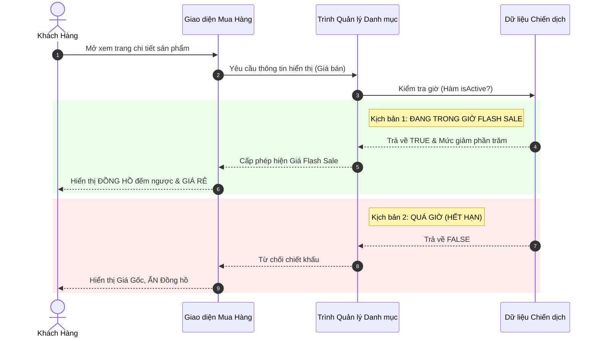
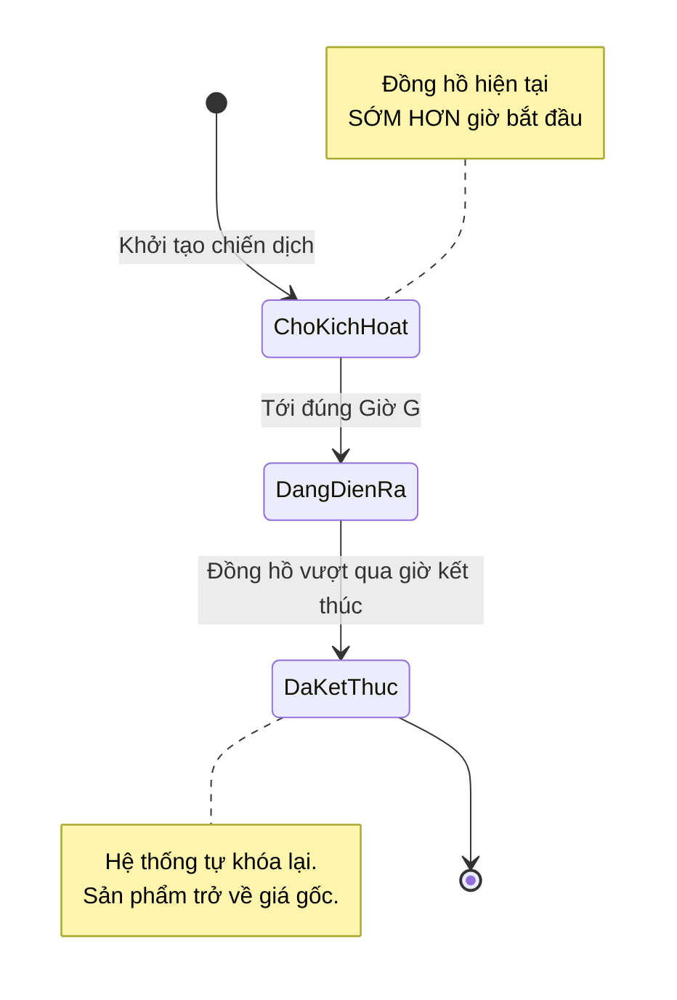
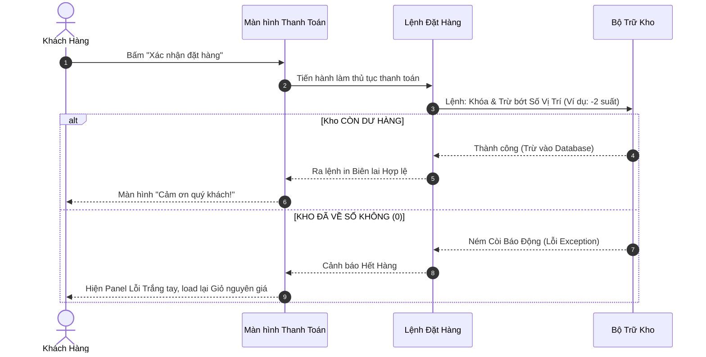
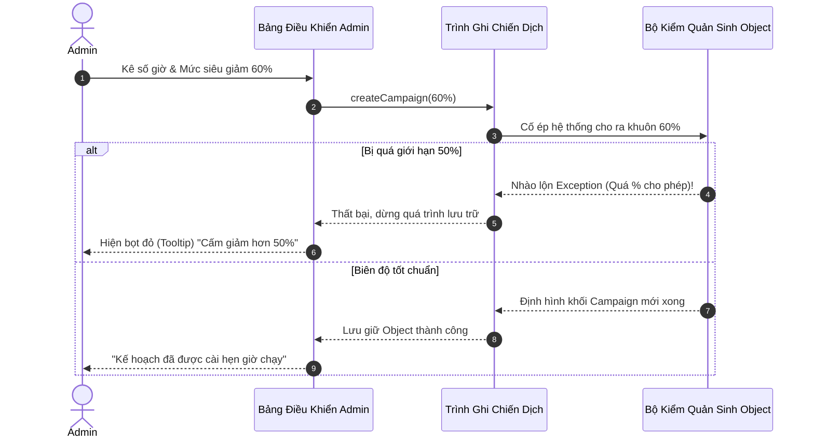
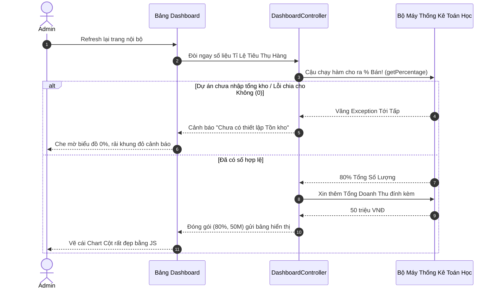
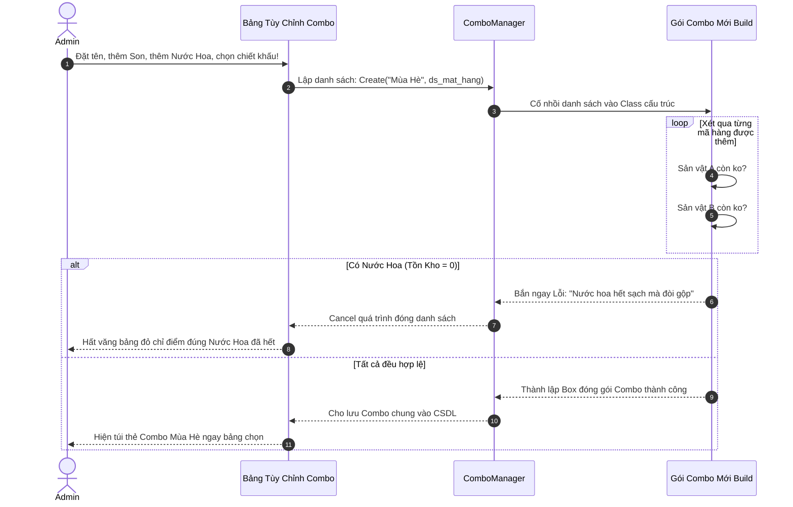

## 🟢 US1: Hiển thị trạng thái Flash Sale trên sản phẩm

### 1. Kiến trúc BCE (Boundary - Control - Entity)
> **Giải thích:** Khách hàng (Boundary) không trực tiếp đòi dữ liệu từ hệ thống tính toán (Entity), mà bắt buộc phải thông qua Bộ lọc (Control) làm nhiệm vụ bảo vệ logic.
```text
  [ BOUNDARY / GIAO DIỆN ]                ( CONTROL / XỬ LÝ )                 { ENTITY / LÕI NGHIỆP VỤ }
  
  ╔════════════════════╗               ┌────────────────────┐               ⟪──────────────────────⟫
  ║ MÀN HÌNH MUA HÀNG  ║ = Lấy SP ===> │ TRÌNH QUẢN LÝ DANH │ == Truy vấn =>│ DỮ LIỆU CHIẾN DỊCH & │
  ║ (CustomerBoundary) ║               │ MỤC (ProductCatalog│               │ MỨC GIẢM (Campaign)  │
  ╚════════════════════╝ <== Trả về == └────────────────────┘ <== Kết quả ==⟪──────────────────────⟫
   Là nơi khách xem, nhấn                Là nhân viên chạy bàn                Là nhà bếp nấu công thức
```

### 2. Sơ đồ Kịch Bản (Sequence Diagram)
> **Giải thích:** Trình tự chi tiết hệ thống tính toán giá và trả về kết quả phụ thuộc vào chiến dịch đang Mở hay đã Tắt.


### 3. Sơ đồ Trạng Thái (State Diagram)
> **Giải thích:** Vòng đời của một chiến dịch đi từ lúc ngủ đông đến lúc tự đào thải.


### 4. Thiết kế Cấu trúc file & Màn hình hiển thị
> Nơi các kỹ sư lưu trữ File và Giao diện phác thảo tương ứng.

```text
📁 CẤU TRÚC FOLDER THEO BCE:
 src/
  ╰─ main/java/com/cosmetics/flashsale/
      ├─ boundary/     ->  CustomerBoundary.ui (File thiết kế giao diện màu sắc)
      ├─ control/      ->  ProductCatalog.java (File điều chế kết nối)
      ╰─ entity/       ->  FlashSaleCampaign.java (File công thức tính toán thời gian)


🖥️ MÀN HÌNH WIREFRAME:
 ╭──────────────────────────────────────────────────────────╮
 │  < Quay lại               Chi tiết Son MAC Ruby Woo      │
 ├──────────────────────────────────────────────────────────┤
 │                                                          │
 │   ╭──────────────╮    [⚡ FLASH SALE ĐANG MỞ BÁN]       │
 │   │              │                                       │
 │   │      [📸]    │    Giá niêm yết: ~~1.500.000 VNĐ~~    │
 │   │   ẢNH CỦA    │    Giá k.mãi:    1.000.000 VNĐ        │
 │   │   SẢN PHẨM   │                                       │
 │   │              │   ╰ Đã tiết kiệm: 500.000 VNĐ ╯       │
 │   ╰──────────────╯                                       │
 │                                                          │
 │   ⏱ Đồng hồ hết hạn: 02:45:10      [ 🛒 THÊM VÀO GIỎ ]  │
 ╰──────────────────────────────────────────────────────────╯
```

---

## 🟢 US2: Xử lý tồn kho và thanh toán

### 1. Kiến trúc BCE
> **Giải thích:** Khi bấm giỏ hàng, thông tin truyền qua Bộ Check-out để đi xin cấp phép trừ kho ảo tại Cột Inventory (Nằm sâu và an toàn nhất).
```text
  [ BOUNDARY / GIAO DIỆN ]                ( CONTROL / XỬ LÝ )                 { ENTITY / LÕI NGHIỆP VỤ }
  
  ╔════════════════════╗               ┌────────────────────┐               ⟪──────────────────────⟫
  ║ GIAO DIỆN XÁC NHẬN ║ = Bấm mua ==> │ ĐIỀU PHỐI ĐƠN HÀNG │ === Lệnh ===> │ BỘ BẢO MẬT TỒN KHO   │
  ║ (CheckoutBoundary) ║               │   (OrderCheckout)  │               │ (FlashSaleInventory) │
  ╚════════════════════╝ <== T/C, Lỗi= └────────────────────┘ <== Trừ kho ==⟪──────────────────────⟫
```

### 2. Sơ đồ Kịch Bản (Sequence Diagram)
> **Giải thích:** Hai trường hợp khi Khách chốt deal; một là Tồn Kho cấp phép, hai là Cản lại vì hết hàng. 


### 3. Thiết kế Cấu trúc file & Màn hình hiển thị
```text
📁 CẤU TRÚC FOLDER:
 src/
  ╰─ main/java/.../
      ├─ boundary/     ->  CheckoutBoundary.html (Nút bấm thanh toán)
      ├─ control/      ->  OrderCheckout.java (Điều khiển giao tiếp giữ chỗ lệnh)
      ╰─ entity/       ->  FlashSaleInventory.java (Giữ khư khư thông tin Số Lượng)

🖥️ MÀN HÌNH WIREFRAME:
 ╭──────────────────────────────────────────────────────────╮
 │  Thanh toán giỏ hàng                                     │
 ├──────────────────────────────────────────────────────────┤
 │                                                          │
 │  Son MAC Ruby Woo                                        │
 │  SL: [ - ]  2  [ + ]   ................... 2.000.000 VNĐ │
 │                                                          │
 │  Tổng cộng (đã giảm):                    2.000.000 VNĐ   │
 │                                                          │
 │   ╔══════════════════════════════════════════════════╗   │
 │   ║ ⚠️ LỖI BÁO TỪ MÁY CHỦ:                           ║   │ <--- (Hiển thị mượt mà)
 │   ║    Rất tiếc! Số suất Flash Sale đã hết.          ║   │
 │   ╚══════════════════════════════════════════════════╝   │
 │                                                          │
 │                     [ XÁC NHẬN ĐẶT HÀNG ]                │
 ╰──────────────────────────────────────────────────────────╯
```

---

## 🟢 US3: Thiết lập chiến dịch (Dành cho Quản trị viên)

### 1. Kiến trúc BCE
> **Giải thích:** Quản lý làm việc với biểu mẫu, Controller truyền tới lõi, nếu % lớn hơn kịch trần, Entity sẽ "cạch mặt" từ chối lưu.
```text
  [ BOUNDARY / GIAO DIỆN ]                ( CONTROL / XỬ LÝ )                 { ENTITY / LÕI NGHIỆP VỤ }
  
  ╔════════════════════╗               ┌────────────────────┐               ⟪──────────────────────⟫
  ║ GIAO DIỆN ADMIN    ║ = Nhấn Lưu => │ BAN QUẢN LÝ TỰ ĐỘNG│ === Lệnh ===> │ BỘ NHIỆM VỤ SINH MỚI │
  ║   (AdminForm)      ║               │  (CampaignManager) │               │ (FlashSaleCampaign)  │
  ╚════════════════════╝ <== T/C, Lỗi= └────────────────────┘ <== Báo lỗi ==⟪──────────────────────⟫
```

### 2. Sơ đồ Kịch Bản (Sequence Diagram)
> **Giải thích:** Tình huống thực tiễn mô tả cách hệ thống chặn "Quyền Lực" của Admin khi vi phạm các giới hạn an toàn.


### 3. Thiết kế Cấu trúc file & Màn hình hiển thị
```text
📁 CẤU TRÚC FOLDER:
 src/
  ╰─ main/java/.../
      ├─ boundary/     ->  AdminFormBoundary.html (Bảng nhập giá trị)
      ├─ control/      ->  CampaignManager.java (Đóng vai thư ký lưu hồ sơ)
      ╰─ entity/       ->  FlashSaleCampaign.java (Các quy định cứng)

🖥️ MÀN HÌNH WIREFRAME:
 ╭──────────────────────────────────────────────────────────╮
 │  [ADMIN] Tạo mới chiến dịch Flash Sale                   │
 ├──────────────────────────────────────────────────────────┤
 │                                                          │
 │  ⏱ Giờ bắt đầu: [ 08:00 AM ▾]                           │
 │  ⏱ Giờ kết thúc: [ 12:00 PM ▾]                           │
 │                                                          │
 │  🔥 Điền mức sale (%):                                   │
 │   ╭──────────────────────────────────╮                   │
 │   │ 60                               │ ❌ Không hộp lệ  │
 │   ╰──────────────────────────────────╯                   │
 │  [ LƯU CHIẾN DỊCH KHUYẾN MÃI ]                           │
 │                                                          │
 │  > _Mức giảm cho phép vượt rào kịch trần là 50%_         │
 ╰──────────────────────────────────────────────────────────╯
```

---

## 🟢 US4: Báo cáo hiệu quả thời gian thực

### 1. Kiến trúc BCE
> **Giải thích:** Admin ngồi xem Dashboard, hệ thống phải liên tục móc qua Analytics nhẩm tỷ lệ. Đề phòng máy nhẩm lỗi nếu Cấu hình chưa được nhập từ trước.
```text
  [ BOUNDARY / GIAO DIỆN ]                ( CONTROL / XỬ LÝ )                 { ENTITY / LÕI NGHIỆP VỤ }
  
  ╔════════════════════╗               ┌────────────────────┐               ⟪──────────────────────⟫
  ║ TẤM NỀN CHARTIST   ║ = Yêu cầu ==> │ CỘNG TÁC VIÊN ĐỌC  │ === Chọc ===> │ MÁY QUÉT KPI NHÀ KHO │
  ║(DashboardBoundary) ║               │ (DashboardControl  │               │   (SaleAnalytics)    │
  ╚════════════════════╝ <== Đồ Thị == └────────────────────┘ <== Kết quả ==⟪──────────────────────⟫
```

### 2. Sơ đồ Kịch Bản (Sequence Diagram)
> **Giải thích:** Giao diện cần xin 2 số liệu từ máy lõi.


### 3. Thiết kế Cấu trúc file & Màn hình hiển thị
```text
📁 CẤU TRÚC FOLDER:
 src/
  ╰─ main/java/.../
      ├─ boundary/     ->  DashboardBoundary.html (Biểu đồ)
      ├─ control/      ->  DashboardController.java (Tính toán đầu cuối)
      ╰─ entity/       ->  SaleAnalytics.java (Chứa các biến cộng dồn Total)

🖥️ MÀN HÌNH WIREFRAME:
 ╭──────────────────────────────────────────────────────────╮
 │  [ADMIN] Real-time Két Sắt Số Liệu (Live)                │
 ├──────────────────────────────────────────────────────────┤
 │                                                          │
 │   Tỷ lệ xả hàng (%):                                     │
 │   [██████████████████████             ] 80.0%            │
 │                                                          │
 │   Doanh thu đạt được đến trưa nay:                       │
 │   💰 50,000,000 VNĐ                                      │
 │                                                          │
 │   [ Cập Nhật Lại ]          Tình trạng: Mượt mà ✔        │
 ╰──────────────────────────────────────────────────────────╯
```

---

## 🟢 US5: Quản lý Sản phẩm và Combo Sale

### 1. Kiến trúc BCE
> **Giải thích:** Liên kết nhiều SP vào chung một khay mang tên là `Combo`.
```text
  [ BOUNDARY / GIAO DIỆN ]                ( CONTROL / XỬ LÝ )                 { ENTITY / LÕI NGHIỆP VỤ }
  
  ╔════════════════════╗               ┌────────────────────┐               ⟪──────────────────────⟫
  ║ GIAO DIỆN KẾT HỢP  ║ = Kéo thẻ ==> │ BAN QUẢN LÝ NHÂN SỰ│ === Nhét ===> │ LẴNG COMBO TỔNG HỢP  │
  ║  (ComboBoundary)   ║               │   (ComboManager)   │               │   (FlashSaleCombo)   │
  ╚════════════════════╝ <== Lưu OK == └────────────────────┘ <== Xét Duyệt=⟪──────────────────────⟫
```

### 2. Sơ đồ Kịch Bản (Sequence Diagram)
> **Giải thích:** Vòng lặp đệ quy trong hệ thống để lục soát, bắt lỗi nếu Admin bỏ sót nhét 1 sản phẩm hết hạn/rỗng vào giỏ Combo.


### 3. Thiết kế Cấu trúc file & Màn hình hiển thị
```text
📁 CẤU TRÚC FOLDER:
 src/
  ╰─ main/java/.../
      ├─ boundary/     ->  ComboBoundary.html (Tích ô chọn vật phẩm)
      ├─ control/      ->  ComboManager.java (Đẩy các Box vào Kho Quản trị)
      ╰─ entity/       ->  FlashSaleCombo.java (Nhét tất cả vào 1 Entity tổ)

🖥️ MÀN HÌNH WIREFRAME:
 ╭──────────────────────────────────────────────────────────╮
 │  [ADMIN] Tạo Hộp Nhóm - Combo Sale                       │
 ├──────────────────────────────────────────────────────────┤
 │ Tên Combo đặt: [ Combo Mùa Hè 2026 .............. ]      │
 │                                                          │
 │ Mặt hàng đem vào gói Group:                              │
 │ [x] Son MAC Ruby Woo (Tồn: 10 cái)                       │
 │ [x] Nước hoa Chanel (Tồn: 0 cái)  <-- Vô tình tích nhầm  │
 │                                                          │
 │ Trị giá cắt máu (% giảm hộp): [ 30 ]                     │
 │                                                          │
 │ [ TIẾN HÀNH ĐÓNG GÓI! ]                                  │
 │                                                          │
 │ 🚫 Lỗi kẹt kho: Thằng "Nước hoa Chanel" rỗng rồi sếp ơi! │
 ╰──────────────────────────────────────────────────────────╯
```
