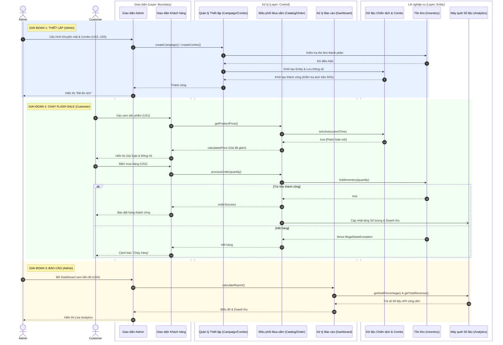

# Tổng Quan: Sơ đồ Tuần Tự (Sequence Diagram) Toàn Dự Án

Sơ đồ dưới đây mô tả luồng hoạt động tổng thể của toàn bộ hệ thống Flash Sale từ lúc bắt đầu thiết lập chiến dịch cho đến khi khách hàng mua hàng và xem báo cáo tài chính. 

Hệ thống được thiết kế chặt chẽ theo kiến trúc **BCE (Boundary - Control - Entity)** nhằm tách biệt giao diện hiển thị, logic điều hướng và lõi nghiệp vụ.

## 1. Sơ đồ Tuần Tự Toàn Cảnh (Global Sequence Diagram)

## 2. Giải thích chi tiết các pha xử lý

Sơ đồ bao trọn 5 User Stories (US) chính và chia làm 3 giai đoạn độc lập:

### Giai đoạn 1: Chuẩn bị & Thiết lập (Setup Phase)
- **Actor:** Admin
- Quản trị viên (Admin) tạo chiến dịch (US3) và gom nhóm Combo sản phẩm (US5).
- Tầng **Control** (`SetupCtrl` đại diện `CampaignManager` / `ComboManager`) sẽ điều phối các thông tin từ Giao Diện.
- Tầng **Entity** (`E_Inv` và `E_Camp`) sẽ thực hiện validate các quy tắc cứng:
  - Phải kiểm tra hàng trong kho (`FlashSaleInventory`) xem có đủ tạo Combo không.
  - Phải xác minh Mức Sale không được vượt quá tối đa quy định (`FlashSaleCampaign`).

### Giai đoạn 2: Vận hành Flash Sale (Execution Phase)
- **Actor:** Customer
- Khách hàng (Customer) lướt xem hàng hóa. Tầng giao diện (`CustomerUI`) đòi giá từ Control (`ProductCatalog`), Control gọi xuống Entity (`FlashSaleCampaign`) kiểm tra thời gian Server xem có hiệu lực hay không (US1).
- Khi người mua nhấn **Thanh toán**, Control (`OrderCheckout`) ra lệnh cho Entity tồn kho (`FlashSaleInventory`) trừ trực tiếp vào RAM đồng bộ (Synchronized) để tránh gian lận / Over-booking (US2).
- Nếu kho nhận lệnh hợp lệ, lưu lượng sẽ được báo cho thực thể báo cáo (`SaleAnalytics`) để cộng dồn KPI.

### Giai đoạn 3: Báo cáo Thống kê (Analytics Phase)
- **Actor:** Admin
- Xảy ra theo thời gian thực (Real-time). Admin xem Dashboard, hệ thống liên tục lấy tham số doanh thu qua Controller (`DashboardController`) từ Entity bộ nhớ (`SaleAnalytics`) không qua khâu rườm rà (US4). Mọi biểu đồ được cập nhật sống động!

## 3. Kiến trúc Tổng quát BCE

* **Layer Boundary (Giao Diện/Biên):** Không chứa bất kỳ quy tắc tính toán nào. Chỉ chịu trách nhiệm tiếp nhận tương tác của người dùng, Form nhập liệu và hiển thị kết quả HTML/UI.
* **Layer Control (Điều Khiển/Môi giới):** Các lớp kết nối (Manager, Controller, Checkout). Làm cầu nối luân chuyển dữ liệu từ màn hình vào Lõi, điều phối nhiều Entity cùng lúc.
* **Layer Entity (Chủ Thể/Lõi Logic):** Chứa các quy định "Thép", ví dụ: khóa Thread-safe không cho mua trùng (Hold Inventory), ném lỗi khi thiếu số lượng cấu hình, hoặc chặn lưu khi giảm giá quá mớ. Nơi thuần túy bảo vệ tài sản doanh nghiệp.
